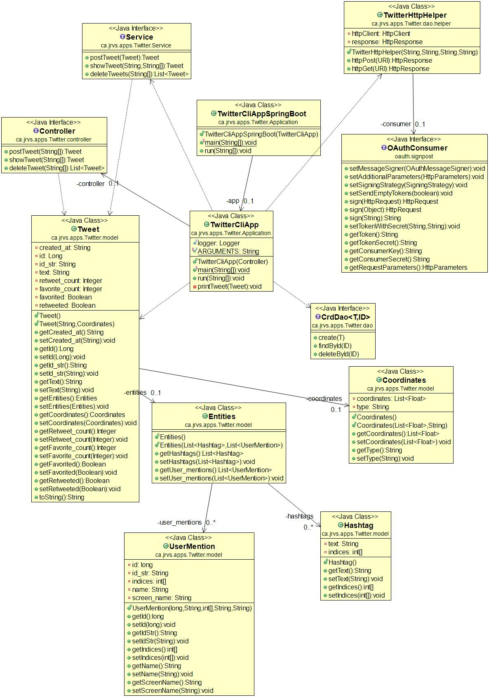

# Introduction

To produce, read, and delete Tweets, this application uses the Twitter API v1.1. Development of Application involves using Java SprinbBoot, and the type of actions to be performed is specified as user input in the command line. This application is also run in a Docker container.Applications are managed through maven.

# Quick Start

Usage:
TwitterApp post|show|delete [options]

Run Commands:

- `docker pull pjashwinrishi/twitter.`
-    ```
      docker run --rm \
      -e consumerKey=CONSUMER_KEY \
      -e consumerSecret=CONSUMER_SECRET \
      -e accessToken=ACCESS_TOKEN \
      -e tokenSecret=ACCESS_TOKEN_SECRET \
      pjashwinrishi/twitter post|show|delete [options]
      ```

- Options:
    - post: tweet_text latitude:longitude
    - show: tweet_id [field1,field2 ...]
    - delete: [id1, id2, ...]


# Implementation

The following section explains the er diagram, design patterns, testing, and Deployment to perform the Create, read and delete operations.

## UML diagram

Have used reverse engineering to produce the class diagram from the code written.



## Design Patterns

The execution of the Application starts from `TwitterCliAppSpringBoot.` The Application uses spring boot to manage dependencies and injects instances across the various classes. The hierarchy of dependency is of `TwitterController` -> `TwitterService` -> `TwitterDao` -> `TwitterHelper`. 

## Controller
The ```TwitterController``` gathers the input from the user using the command-line interface. Also, it validates the number of arguments and performs transferring of values to the service layer.

## Service
The ```TwitterService``` class handles the business layer of the Application, which involves invalidating the tweet length, latitude, and longitude corrections for the type of operations gathered from the input.

## Data Access Object (DAO)
The ```TwitterDao``` involves calling the twitter rest API v1.1 and mapping the response to the models/dto defined in the application where we use `Jackson` to map objects from `HttpResponse` to Data models.
the ```TwitterHelper``` is used to return the `HttpResponse` required for ``` TwitterDao ``` object.

# Test
The Application was tested in JUnit version 4 as part of integration testing. In unit testing, the Mockito Framework was used, and mock objects to avoid making API calls in the `TwitterHelper` class.

# Deployment

Have been deployed into Docker for minimal distribution of usages. Docker Images can be used across multiple platforms to access the Application. The entire Application has been hoisted in Github for easy access.

The below steps can be used to create an image and deploy the same in DockerHub.

```bash
#Create dockerfile
cat > Dockerfile << EOF
FROM openjdk:8-alpine
COPY target/Twitter*.jar /usr/local/app/grep/lib/Twitter.jar
ENTRYPOINT ["java","-jar","/usr/local/app/grep/lib/Twitter.jar"]
EOF

#Package your java app
mvn clean package

#build a new docker image locally
docker build -t ${pjashwinrishi}/twitter .


# Improvement

- We can use Builder Pattern instead of getters and setters for code injections which ensures chaining of methods and data security.
- After the operations of post, show, and delete is performed. If the user inputs show or delete without posting a tweet, the application throws an error message. This can be avoided by validating the Id before the show and deleting operations.

