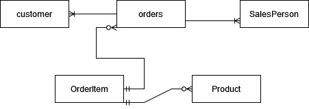

# Introduction

This Application uses JDBC API with the drivers to perform CRUD(Create, Read, Update, Delete) tasks into the PostgreSQL.We also have used DAO and DTO patterns to perform the CRUD operations.
The Technologies used are PostgreSQL, Maven, Docker, Java.

# Implementation

This section explains the er diagram and its design patterns to perform the CRUD operations.

## ER Diagram

The ER diagram depicts the relationship between the tables used:


## Design Patterns

A significant difference between the DAO and Repository design pattern is that the repository pattern works on single-table access per class. Repository does join in the Service layers. Repository helps to shard of database and usually preferred in such case w. The repository scales horizontally, and DAO does it by vertically scalable. Also, a Repository is generally a narrower interface. It is simply a collection of objects, with a Get(id), Find(specification), Add(Entity).

The DAO pattern is an abstraction of data persistence. In contrast, the repository pattern is an abstraction of a collection of objects.DAO pattern separates the domain logic that uses it from any particular persistence mechanism or APIs. The repository could be implemented using DAO's, but we would not do the opposite.

# Test

The Application was tested through the main method, and results were evaluated in the console. JDBCExecutor has been modified for each step of creating, inserting and updating, and deleting operations. Additionally with procedure and limits were also tested using the main method. Joint operations were displayed in the console.

Before performing the operations. We need to execute batches given below to validate the values:

```bash
#Data Setup
#Create database:
SQL -h localhost -U Postgres -f database.sql

#Insert test customer data into the customer table
SQL -h localhost -U Postgres -d passport -f customer.sql

#Insert test product data into product table
psql -h localhost -U Postgres -d hplussport -f product.sql

#Insert test salesperson data into salesperson table
psql -h localhost -U Postgres -d hplussport -f salesperson.sql

#Insert test orders data into orders table
psql -h localhost -U Postgres -d hplussport -f orders.sql
```
